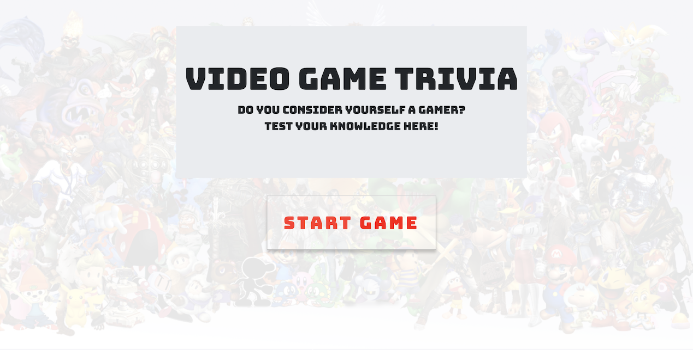
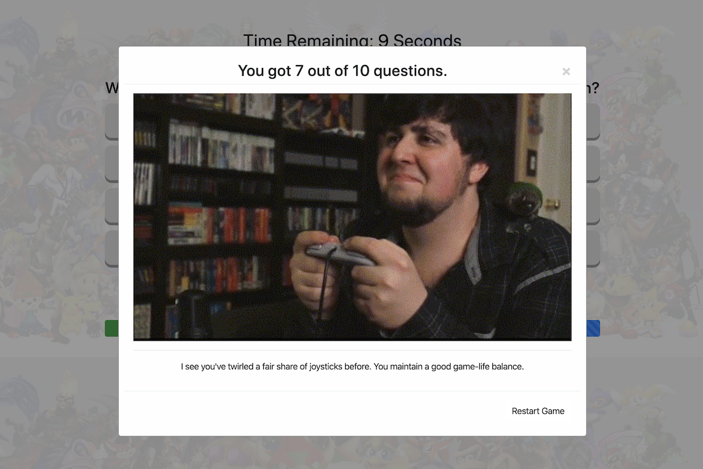

# [Trivia Game](https://danninemx.github.io/TriviaGame/)

## Overview

This is a simple, video game-themed trivia game built using JavaScript for the logic and jQuery to manipulate HTML.

The inspiration was to build a project such as this: https://youtu.be/xhmmiRmxQ8Q

---

## How to play

1. Visit the deployed page. (https://danninemx.github.io/TriviaGame/)

   

2. Press the button to start.

3. A trivia question will be presented with choices. Click a button to answer before the **timer** runs out!

4. After each answer, you will be presented with the answer key. Don't linger too long, as you have limited time to enjoy reading the answer.

5. After all questions have been answered, you will be given your rating (with multiple "endings", wink wink) and a chance to redeem yourself. (i.e. restart)

   

---

## Components

- [HTML](index.html)
- [JavaScript](./assets/javascript/app.js)
- [jQuery](https://jquery.com/)
- [CSS](./assets/css/style.css)
- [Bootstrap](https://getbootstrap.com/)
